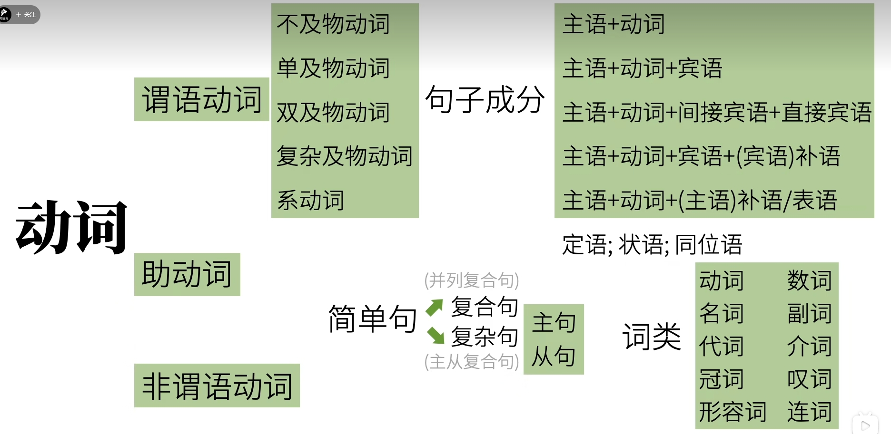
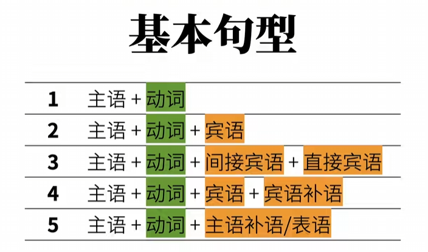
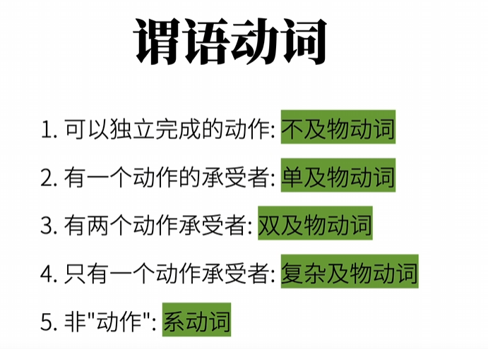
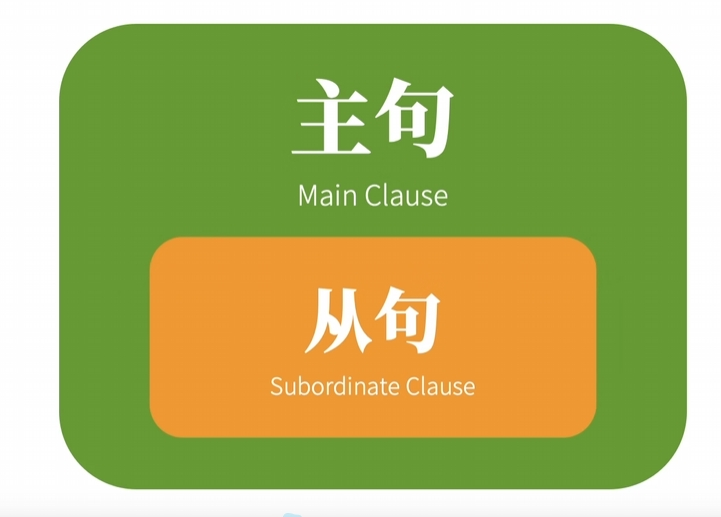
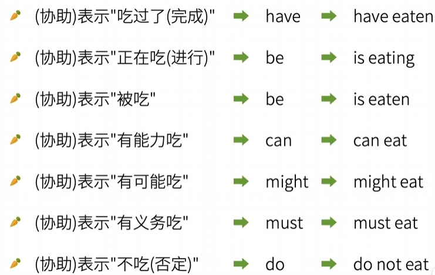
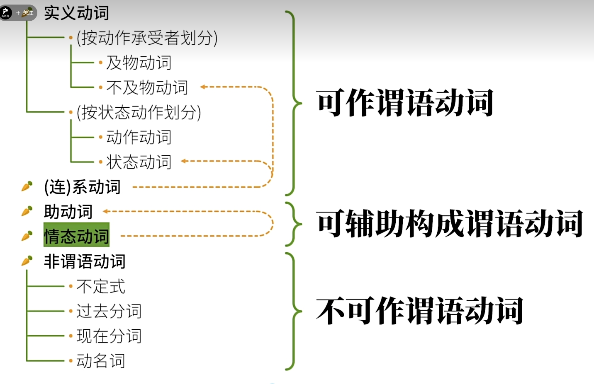

## 英语语法综述

所有的英语语法都是主语(Subject)+谓语(predicate)

主语: 人/物

谓语: 动作/发生了什么事

这里的动作是动词(Verbs)的意思

### 动词(动作)

1. 可以独立完成的动作

   主语+不及物动词

   

   Miaomiaomiao sleeps

   sleeps是不及物动词，就是没有承受者的动词

2. 有1个动作的承受者

   主语+单及物动词+宾语

   

   Miaomiaomiao likes you

   比如这里的喜欢，没有喜欢者也就是承受者就没有什么实际意义，这种动词属于及物动词

3. 有2个动作的承受者

   主语+双及物动词+间接宾语+直接宾语

   

   Miaomiaomiao teaches you English（喵喵喵教你英语）

   这里教授的知识是英语，而知识的接受对象是你

   这里我们分为双及物动词，直接宾语和间接宾语

   直接宾语: English

   间接宾语: you

   teaches : 双及物动词

4. 只有1个动作承受者(但需补充)

   主语+复杂及物动词+宾语+(宾语)补语

   

   Miaomiaomiao considers you smart（喵喵喵认为你聪明）

   复杂及物动词 considers

   宾语 you

   (宾语)补语 smart

5. 非"动作"

   主语+系动词+(主语)补语/表语

   (主语)补语也称为表语

   

   Miaomiaomiao is tall(喵喵喵是高的)

   is为代表的一类词，作用就是将后面的高赋予前面的喵喵喵，说白了就是把Miaomiaomiao和tall连在一起

   Miaomiaomiao is in the room

   其实就是把in the room这个状态性质赋予给miaomiaomiao而已

   Miaomiaomiao looks tall（喵喵喵看起来高）

   这里的看，其实是被看，其实也是把后面的tall赋予给前面的Miaomiaomiao而已

   Miaomiaomiao smeels nice （喵喵喵闻起来香）

   其实这里也是把喵喵喵和香画等号，但是在赋值的同时加上了闻上去这层含义

   

   上面的looks和上面的is都类似于计算机里给变量赋值，但是looks这个相当于除了有赋值功能，还有看上去这个含义

   像上面这种is,looks,smeels这种可以给主语赋予某种性质的动词，我们称之为连系动词，也称为系动词

   

   

   上面总结下来，其实就是主语+动词+动词需要的几个对象才能表达完成的意思

   

### 五大句型

   

   

   ### 谓语动词

   英语的句子被拆的不能再拆时，其实都是主语+谓语，也就是什么+怎么样

   什么是语法上的主语

   怎么样是语法上的谓语

   谓语会有一个核心动词，叫做谓语动词

   谓语包含谓语动词，谓语动词是谓语的子集

   谓语动词可以分为:

   

#### 动作时间

谓语动词有着我们中文没有的功能，就是时态

谓语动词的时态，就是动作的时间和动作的状态

时态可分为:

##### 现在

##### 过去

##### 将来

##### 过去将来

表示过去表达对将来的意图

比如，她说她下周会来看我

#### 动作状态

##### 一般

##### 完成

##### 进行

##### 完成进行

用于表示某个动作从过去某个时间开始，一直持续到现在（或过去某个时间），并且可能还会继续下去。

比如她已经学习了三个小时。

#### 时态

动作时间和动作将来可以进行排列组合，所以总共由16种时态

#### 动作假设，情感

就是动作的语气

##### 虚拟语气

用来表示意愿，和事实相反的假设

比如:

If I were you, I would take the job.

如果我是你，我会接受这份工作。

##### 陈述语气

##### 起始语气

### 句子成分

1. 主语 Subject

2. 谓语动词 Predicate Verb

3. 宾语 Object

4. 宾语补语 Object Complement

5. 主语补语 Subject Complement

6. 定语 Attributive

   The little white rabbit ate a large carrot.

   这只小白兔吃了一根大胡萝卜

   the little white就是主语rabbit的定语

   a large就是宾语carrot的定语

7. 状语 Adverbial

   主要用来修饰谓语动词

   The rabbit ate quickly.(兔子快速的吃)

   quickly就是ate的状语

8. 同位语 Appositive 

   主要用来再把主语或宾语说一遍

   Papa Rabbit,an English teacher,eats carrots.（兔老爹，一个英语老师，吃胡萝卜）

   这里的an English teacher其实就是把Papa Rabbit用不同的方式再说一遍，这里算是和主语同等地位。

### 句子类型

####  简单句

上面的句子都是简单句

#### 复合句

也称为并列句

#### 复杂句

就是简单句互相嵌套，可以互相套娃，

一个句子套另一个句子，在语法上称为主句和从句

关系如下

相当于把简单句修改一下，充当另一个句子的句子成分

比如我们修改一个简单句，它就可以充当另一个句子的主语，这就是主语从句

修改一个简单句，充当另一个句子的宾语，这个就是宾语从句

修改一个简单句，充当另一个句子的表语，这个就是表语从句

修改一个简单句，充当另一个句子的同位语，这个就是同位语从句

主语从句、宾语从句，表语从句，同位语从句合成名词从句

简单句还可以充当定语和状语，这个就是定语从句和状语从句

### 词类

#### 动词

上面有讲

#### 名词
表示人和物，比如rabbit

#### 冠词
主要用来限定名词

比如Papa Rabbit is a rabbit
兔老爹是只兔子
这里的a(只)就是冠词

#### 代词
替代人和物
I am a rabbit
这里的I就是代词

#### 形容词

用于修饰名词或者代词

I am a smart rabbit
我是只聪明的兔子

这里的smart(聪明的)就是形容词

#### 数词

用于表示数量，顺序或者倍数

I ate two carrots

我吃了两根胡萝卜

这里的two(两)就是数词

#### 副词

修饰动词或形容词，它们通常描述动作发生的方式、时间、地点、频率、程度等。

I ate two carrots quickly

我很快地吃了两根胡萝卜

#### 介词

表示和其他词关系的词

I ate two carrots with chopsticks

我用筷子吃了两根胡萝卜

这里的with(用)就是介词

#### 叹词

表示感叹

An,the carrot is tasty

啊，胡萝卜好美味

这个An(啊)就是叹词

#### 连词

连接词和句子

I ate two carrots and a potato,because I was hungry.

我吃了两根胡萝卜和马铃薯，因为我饿了

这列的because(因为)就是连词

一个句子可能由很多词类组成，但是谓语动词只能是动词

### 助动词

助动词的作用就是帮助谓语动词

但是有些助动词没有实际含义

### 非谓语动词

动词除了可以作为谓语动词，还能做主语，宾语，宾语补语、主语补语、定语...这里的都是非谓语动词

## 动词分类

五大谓语动词对应了五大类句型

* 及物

  要带个物品和任务的意思

* 及物动词

  动词要带个物品和任务的意思

